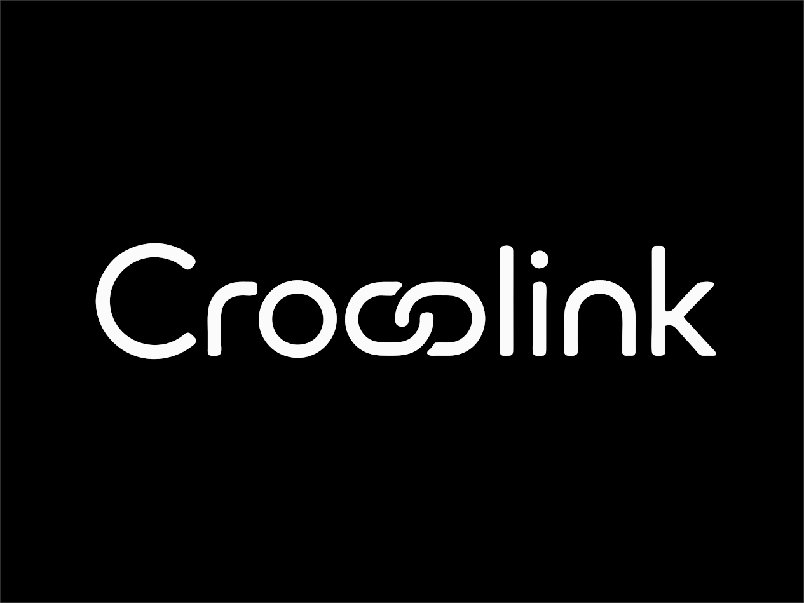

<p align="center">
  
</p>

<h3 align="center">Universal secure app-to-app connectivity.</h3>

<p align="center">
  End-to-end encrypted channels between any app on your computer and any app on your phone.
  <br />
  Paired once by scanning a QR code. Reconnected automatically forever after.
</p>

<p align="center">
  <a href="https://github.com/jacobpowaza/crosslink/blob/main/LICENSE"></a>
  
  
  
  
  <a href="https://github.com/jacobpowaza/crosslink/security"></a>
</p>

---

## What is Crosslink?

Crosslink lets any app on your computer talk to any app on your phone or
browser over an end-to-end-encrypted channel — paired once by scanning a QR
code, then reconnected automatically forever after.

```
┌───────────────┐   LAN / WebRTC / relay    ┌──────────────┐
│  App A (host) │ ◀══ E2E encrypted ══════▶ │ App B (phone)│
│  Node.js SDK  │     CLX1 sessions         │ Browser SDK  │
└───────────────┘                           └──────────────┘
        ▲                ▲      ▲
        └── signaling ────┘      └── relay (dumb pipe) ──┘
```

## Why?

Every app reinvents device pairing: ad-hoc tokens, hand-copied keys, homegrown
crypto, brittle sockets. Crosslink packages the hard parts once:

| Concern | What Crosslink gives you |
| --- | --- |
| **Pairing** | Single-use 9-digit code + QR; SAS verification words; fingerprint pinning |
| **Identity** | One Ed25519 key per installation; revocation lists persisted locally |
| **Crypto** | X25519 + HKDF handshake ("CLX1"), XChaCha20-Poly1305 session frames |
| **Authorization** | Capability grants per device, host-authored policy, per-use consent |
| **RPC** | Typed request/response, streaming progress chunks, event subscriptions |
| **Transports** | LAN WebSocket → crosslink relay → WebRTC DataChannel, auto-fallback |
| **Reconnect** | Exponential backoff, offline call queueing, subscription restore |
| **Secrets** | Host seed in the OS keychain; browser seed under a non-extractable WebCrypto key |
| **Observability** | Structured, redacting `Logger` threaded through every layer |
| **Bootstrap** | Hosted HTTPS QR for iOS Add to Home Screen; tunnel-ready for cross-network |

Services are dumb by design: **signaling never sees keys or plaintext**, and the
relay forwards only opaque ciphertext.

## Quickstart

```bash
# Clone and install
git clone git@github.com:jacobpowaza/crosslink.git
cd crosslink
npm install

# Start the local services
npm run stack          # signaling :8081 + relay :8082

# Terminal A — run a host app
npm run demo:echo      # prints a pairing code + QR

# Terminal B — serve the browser client
npm run demo:pwa       # http://localhost:8090
```

Scan the host QR with the PWA (or paste `crosslink://pair?…`), confirm the SAS
digits, and start calling RPC methods over the encrypted channel.

### Cross-network (phone on different WiFi)

You need a tunnel. See [docs/TUNNELING.md](docs/TUNNELING.md) for the full
guide. Quick version:

```bash
# In separate terminals
npm run stack
ngrok tcp 8081    # copy the wss://… URL
ngrok tcp 8082    # copy the second wss://… URL

# Start the host with the tunnel URLs
CROSSLINK_SIGNALING_URL=<wss-from-ngrok-8081> \
CROSSLINK_RELAY_URL=<wss-from-ngrok-8082> \
npm run demo:echo
```

Or use the built-in tunnel support in the chat app:

```bash
npm run demo:chat     # web UI has ngrok/Cloudflare tunnel buttons
```

## Host App (~20 lines)

```ts
import { createCrosslinkServer } from "@crosslink/sdk-node";
import { consoleLogger } from "@crosslink/core";

const server = createCrosslinkServer({
  application: { id: "com.me.notes", name: "Notes" },
  capabilities: [
    { id: "notes.read", title: "Read notes", risk: "low", defaultGranted: true },
    { id: "notes.purge", title: "Delete everything", risk: "high", confirmEachUse: true },
  ],
  permissions: { maxAutoGrantRisk: "low", requireApproval: "high" },
  onConsentRequest: (req) => confirm(`Allow "${req.title}"?`),
  logger: consoleLogger({ level: "info" }),
});

server.expose("notes.get", () => db.getNote(), { capability: "notes.read" });
server.expose("notes.purge", () => db.purge(), { capability: "notes.purge" });
server.declareEvent("notes.changed");

await server.start();
const code = await server.getPairingCode();
console.log("Pair:", code.code);
```

## Browser Client

```ts
import { createCrosslinkClient } from "@crosslink/sdk-browser";

const client = createCrosslinkClient({
  deviceName: "Pixel 9",
  onStateChange: (state) => console.log(state),
  onConfirmPairing: async ({ sas, grantedCaps }) => {
    return window.confirm(`Match? ${sas} caps=${grantedCaps}`);
  }
});

await client.pairFromQr(uriText, ["notes.read"]);
const rpc = await client.connect();
await rpc.call("notes.get");
rpc.subscribe("notes.changed", rerender);
```

Optionally upgrade to a direct WebRTC DataChannel:

```ts
import { tryUpgradeToWebrtc } from "@crosslink/webrtc-adapter";

await tryUpgradeToWebrtc(client.connection!, {
  createPeer: () => new RTCPeerConnection({ iceServers }),
});
```

## Transport Modes

Crosslink automatically selects the best transport:

| Priority | Transport | When it works | Setup needed |
|---|---|---|---|
| 1 | **LAN WebSocket** | Phone + laptop on same WiFi | None — host binds automatically |
| 2 | **Crosslink relay** | Any network topology | `npm run stack` or tunnel |
| 3 | **WebRTC DataChannel** | Post-connection upgrade | WebRTC adapter in browser |

The client SDK tries each in order, falling through on failure. Sessions
survive IP changes via reconnect with exponential backoff.

## Architecture

```
┌─────────────────────────────────────────────────────────────┐
│                      Desktop App                            │
│  createCrosslinkServer()                                    │
│                                                             │
│  ┌──────────────┐   ┌──────────────┐   ┌──────────────┐    │
│  │ LAN Listener │   │ Relay Client │   │ Signaling    │    │
│  │ ws://0.0.0.0 │   │ (mux channel)│   │ (presence)   │    │
│  └──────┬───────┘   └──────┬───────┘   └──────┬───────┘    │
│         │                  │                   │            │
└─────────┼──────────────────┼───────────────────┼────────────┘
          │                  │                   │
          │  (same Wi-Fi)    │  (different       │  (pairing
          │                  │   network)         │   resolution)
          ▼                  ▼                   ▼
┌─────────────────────────────────────────────────────────────┐
│                      Phone / Browser                        │
│  CrosslinkClient                                            │
│                                                             │
│  Candidates (tried in order):                               │
│    1. LAN direct   → ws://192.168.x.x:port                  │
│    2. Relay        → wss://relay.example.com/channel        │
│                                                             │
│  Upgrade path (after initial connection):                   │
│    relay → WebRTC DataChannel (when direct path available)  │
│                                                             │
└─────────────────────────────────────────────────────────────┘
```

## Security

Crosslink uses audited cryptographic primitives from `@noble/curves` and
`@noble/ciphers` — pure JS, identical behavior in every runtime:

| Purpose | Primitive |
| --- | --- |
| Device identity | Ed25519 signing keypair |
| Key agreement | X25519 (ephemeral + static, double-DH) |
| Session keys | HKDF-SHA256 over (ephemeral DH ‖ static DH) |
| Frame encryption | XChaCha20-Poly1305 AEAD, random 24-byte nonces |
| Hashes / fingerprints | SHA-256 |

**Invariants:**

- **Forward secrecy** — fresh ephemeral X25519 per session; past traffic safe
  after key compromise
- **Mutual authentication** — both sides sign transcripts binding every public
  key, nonce, appId, and deviceId
- **Replay resistance** — per-direction monotonic counters in AEAD associated
  data
- **MITM resistance** — QR pins host fingerprint; SAS adds human verification
- **Untrusted services** — signaling sees hashed codes + opaque signed blobs;
  relay sees only ciphertext
- **Revocation** — immediate at enforcement point; live sessions killed, grants
  dropped

See [docs/SECURITY.md](docs/SECURITY.md) and [docs/THREAT_MODEL.md](docs/THREAT_MODEL.md) for the full analysis.

## Packages

| Package | Purpose |
| --- | --- |
| `@crosslink/protocol` | Wire spec, framing, canonical JSON, conformance fixtures |
| `@crosslink/core` | Crypto, CLX1 handshake, sessions, pairing, RPC engine |
| `@crosslink/sdk-node` | `createCrosslinkServer` for Node.js hosts |
| `@crosslink/sdk-browser` | `createCrosslinkClient` for phones and browsers |
| `@crosslink/webrtc-adapter` | DataChannel transport + SDP exchange over existing sessions |
| `@crosslink/signaling` | Presence directory + pairing-code router |
| `@crosslink/relay` | Stateless encrypted-pipe relay for NAT traversal |

## Apps & Examples

| App | What it does |
| --- | --- |
| `apps/chat` | Full chat app — web host + mobile client, tunnel support built in |
| `apps/demo-pwa` | Installable PWA reference client |
| `examples/echo` | Minimal host — exposes `echo.ping`, pairs in 20 lines |
| `examples/notes` | Notes sync host |
| `examples/todo` | Todo app with local + relay modes |
| `examples/webrtc-upgrade` | Relay → direct WebRTC, wired end to end |

## Documentation

- [Getting started](docs/GETTING_STARTED.md) — build your first pair of apps
- [Tunneling guide](docs/TUNNELING.md) — ngrok, Cloudflare, VPS setup
- [Architecture](docs/ARCHITECTURE.md) — how the pieces fit
- [Protocol spec](docs/PROTOCOL.md) — bytes on the wire
- [Networking](docs/NETWORKING.md) — transport decisions, fallback hierarchy
- [Self-hosting](docs/SELF_HOSTING.md) — run your own signaling/relay
- [Security](docs/SECURITY.md) — crypto choices and invariants
- [Threat model](docs/THREAT_MODEL.md) — what we defend against, what we don't
- [Roadmap](docs/ROADMAP.md) — what's next

## Development

```bash
npm test          # 283 tests: unit, both SDKs, full-stack integration
npm run typecheck # strict TS across every workspace
npm run build     # 18 build targets
```

Both SDKs are unit-testable without a network. `@crosslink/sdk-browser` ships
`MockSocket`, an in-memory `WsLike` pair, so pairing, RPC dispatch, reconnect
and revocation can be driven against a real `HostPairingManager` and
`HostAcceptor` with every failure produced deliberately.

## Roadmap

See [docs/ROADMAP.md](docs/ROADMAP.md) for the full plan. Highlights:

- **M6** — Hardening: OS keychain adapters, pairing approval push, rate-limit
  tuning, structured logging
- **M7** — Scale-out: Redis-backed signaling, relay quotas, multi-region relay
- **M8** — WebRTC end-to-end tests, mDNS/DNS-SD zero-config LAN discovery
- **M9** — Group sessions: star topology with capability-gated peer introductions
- **M10** — Ecosystem: protocol conformance suite, Swift/Kotlin/Rust SDKs,
  hybrid PQ key exchange

## License

Apache 2.0 — see [LICENSE](LICENSE).

---

<p align="center">
  <strong>Help support more of my projects</strong><br />
  <a href="https://venmo.com/u/jacobpowaza">
    
  </a>
</p>

---

## Open LAN Remote (Direct WAN)

Crosslink supports direct remote access without tunnels or paid hosting:
- Router port mapping attempted automatically (UPnP / NAT-PMP / PCP via `packages/nat-map`)
- Public endpoint verified before being advertised (no dead IP in pairing QR)
- Pairing persistent: PWA stores device identity independently of endpoint URL
- Graceful fallback to local tunnel (`localtunnel`) or LAN when WAN unreachable
- Security: pairing rate-limited, external reachability verified, endpoint identity validated
